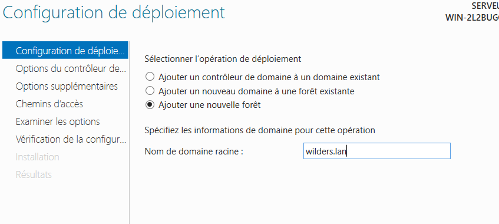

##### Choisir ajouter une fonctionnalité dans la barre outil en haut à gauche du gestionnaire.  

  

##### Sélectionner le serveur après configuration de l'IP statique, ici en 172.168.1.20.  

  

##### Sélectionner Active Directory Domaine Services   

  

##### Choisir les fonctionnalités par défaut jusqu'à l'installation.  

  

##### Valider le post-déploiement.  

  

##### Définir le nom de domaine associé, ici wilders.lan  

  

##### Ajouter la fonction DNS et définissez un mot de passe.  

  

##### Valider, la machine va redémarrer.  

  

##### Connectez vous au domaine en mode admin, ici WILDERS/Administrator. Un service AD-DS a bien été créé.  

  

